# Predicting Negative Cross-Community Hyperlinks on Reddit Using Temporal Signed Network Features

## Abstract

This project studies negative inter-community relationships on Reddit as a temporal signed-network prediction problem. Using the Reddit Hyperlink Network from the Kaggle `Signed Graphs` mirror, with Stanford SNAP/Kumar et al. as the original academic source, each subreddit is represented as a node and each hyperlink as a directed signed edge. Given historical interactions up to a cutoff date, the task is to predict whether a source-target subreddit pair becomes negative-dominant in a future label window. The pipeline compares temporal graph features, text-property features, hybrid features, baselines, ablations, robustness probes, and error-analysis cases under a strict anti-leakage temporal split. The latest full verified run finds that a hybrid Logistic Regression model reaches test PR-AUC 0.1840, ROC-AUC 0.7569, and F1 0.2700, outperforming dummy baselines and a historical negative-ratio heuristic.

## 1. Introduction

Online communities interact through hyperlinks, mentions, and cross-community references. Some of these interactions are positive or neutral, while others are negative. Detecting early signals of negative inter-community relationships can support community health analysis, moderation research, and social media monitoring.

This project frames Reddit as a temporal signed directed network. Each subreddit is a node, each hyperlink from one subreddit to another is a directed edge, and the edge sign is provided by `LINK_SENTIMENT`. The course-project scope is **negative-dominant relationship prediction**, not direct proof of harassment, raids, or real-world conflict.

The project makes four contributions:

1. A leakage-aware temporal signed-network formulation for Reddit cross-community links.
2. A comparison of graph-only, text-only, hybrid, and history-only feature sets.
3. A model comparison against dummy and historical-ratio baselines.
4. Report-facing robustness, threshold, and case-level error-analysis artifacts.

## 2. Related Work

The dataset originates from Kumar, Hamilton, Leskovec, and Jurafsky's work on community interaction and conflict on the web, distributed through Stanford SNAP and mirrored on Kaggle for reproducible access. Classical social network analysis motivates the use of degree, centrality, reciprocity, clustering, and community structure. PageRank provides a way to estimate node importance in directed link structures, while Adamic-Adar-style neighborhood reasoning motivates common-neighbor and local structure features.

Signed-network theory provides the conceptual basis for positive and negative edges. Heider's balance theory and Cartwright-Harary structural balance explain why triadic signed patterns may reveal stable or unstable relationship configurations. Leskovec, Huttenlocher, and Kleinberg further show that signed links in social media carry predictive structural patterns.

Temporal-network research motivates evaluating interactions in chronological order rather than using random splits. This is especially important for social media data because future interactions can leak into historical features if the graph is built on the full dataset. Modern graph representation work such as DeepWalk and GNNExplainer suggests future extensions, but this project intentionally uses interpretable classical ML and network features to remain robust, transparent, and course-appropriate.

## 3. Dataset and Provenance

The project uses the Reddit Hyperlink Network files from Kaggle:

- Kaggle mirror: <https://www.kaggle.com/datasets/wolfram77/graphs-signed>
- Original SNAP source: <https://snap.stanford.edu/data/soc-RedditHyperlinks.html>
- Original paper: Kumar et al., "Community Interaction and Conflict on the Web", WWW 2018.

| File | Rows | Negative Rows | Negative Ratio |
| --- | ---: | ---: | ---: |
| `soc-redditHyperlinks-body.tsv` | 286,561 | 21,070 | 7.35% |
| `soc-redditHyperlinks-title.tsv` | 571,927 | 61,140 | 10.69% |
| Combined | 858,488 | 82,210 | 9.58% |

The local audit confirms that every row has the expected core fields and exactly 86 numeric text-property values. The observed timestamp range is from 2013-12-31 16:20:20 to 2017-04-30 16:58:21. The body and title files are concatenated, and `dataset_source` records whether a row came from the title or body file.

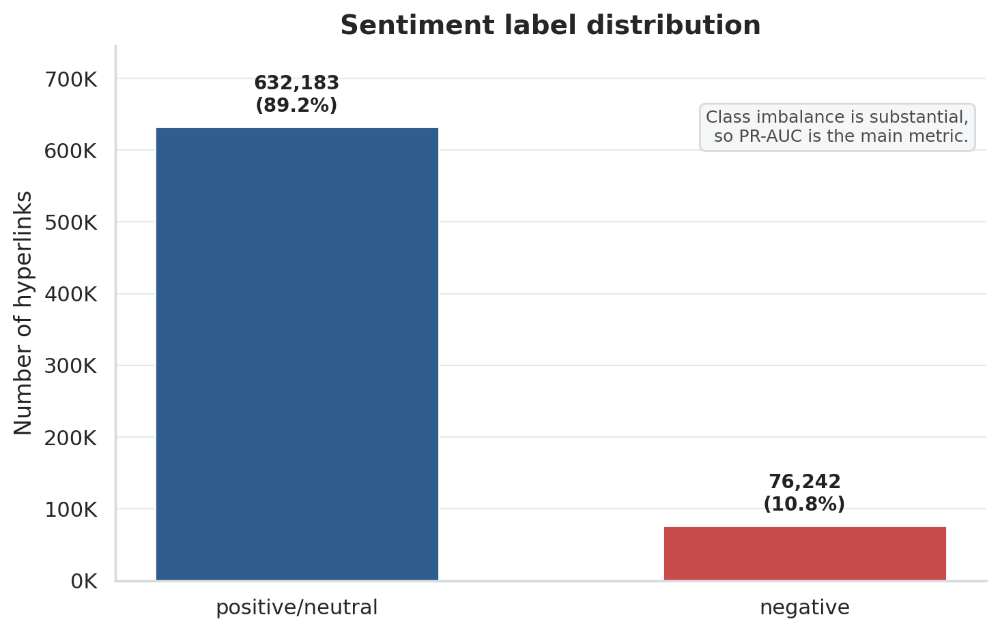

Caption: Negative hyperlinks are a minority class, which is why PR-AUC and negative-class F1 are more informative than accuracy.

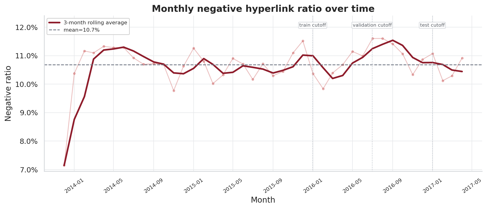

Caption: The negative-link share is relatively stable over time after early 2014, supporting temporal evaluation without an obvious single-period anomaly dominating the result.

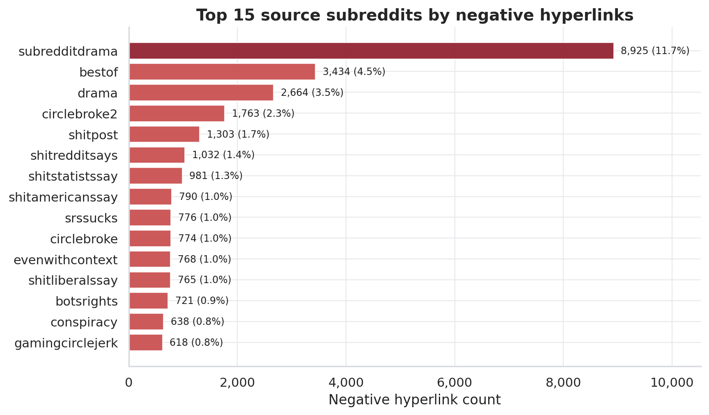

Caption: The most frequent negative-link sources identify communities that repeatedly initiate negative cross-community references.

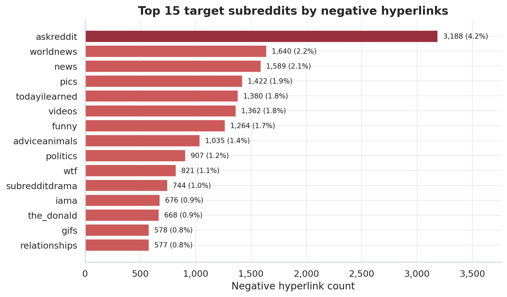

Caption: The most frequent negative-link targets identify communities that repeatedly receive negative cross-community references.

## 4. Problem Formulation

Let each interaction be represented as `(source_subreddit, target_subreddit, timestamp, sign, text_properties)`. For each temporal split, features are computed only from interactions before the history cutoff. Labels are computed from a disjoint future window.

The target is:

- `negative_label = 1` if `future_negative_count > future_positive_count`.
- `negative_label = 0` otherwise.

This is stricter than detecting a single negative edge. It predicts whether the future relationship between a pair of subreddits is negative-dominant.

## 5. Methodology

The workflow has four phases:

1. Data preparation: load raw TSV files, standardize columns, parse timestamps, concatenate title/body data, remove invalid rows and self-loops, and apply k-core filtering for tractability.
2. Network construction: build a directed signed multigraph where subreddits are nodes and hyperlinks are signed directed edges.
3. Feature engineering: create temporal graph, pair-history, community, structural-balance, and text-property features.
4. Modeling and evaluation: train models under strict temporal splits and compare metrics on validation and test windows.

The main feature groups are:

| Group | Examples |
| --- | --- |
| Pair history | interaction count, positive count, negative count, negative ratio, sentiment balance |
| Node/network | in-degree, out-degree, signed degree, PageRank, betweenness, reciprocity |
| Community/clustering | clustering coefficient, community size, same-community flag, community negativity gap |
| Structural balance | common neighbors, signed triad-pattern counts |
| Text properties | `text_property_00` to `text_property_85`, title/body source indicators |

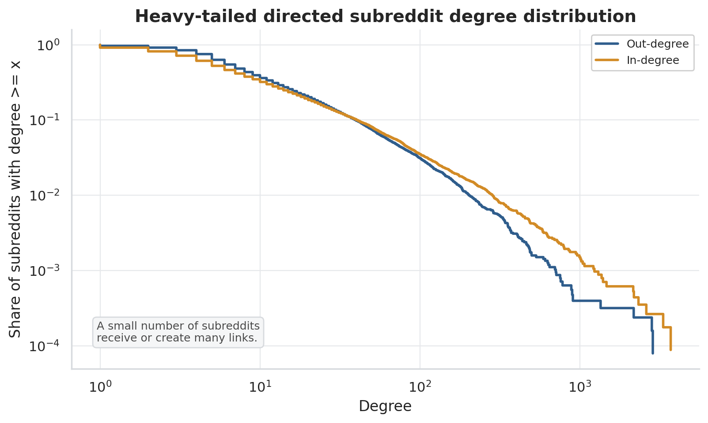

Caption: The degree distribution is highly skewed, motivating graph filters and centrality features instead of treating all subreddit pairs as equally informative.

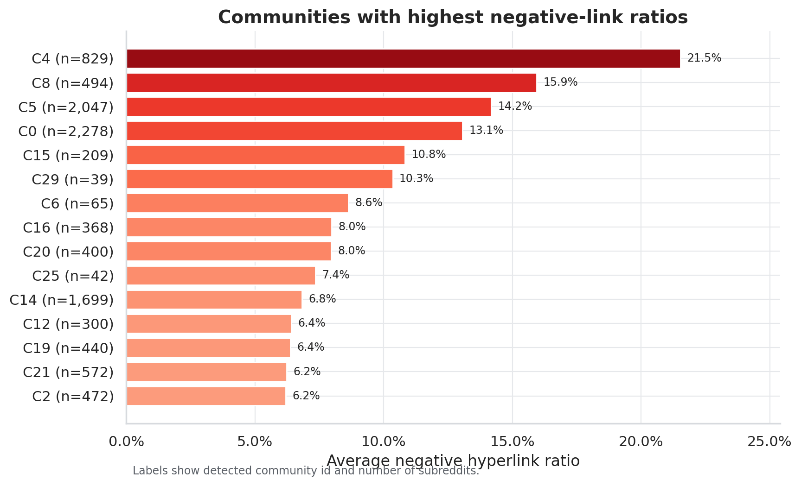

Caption: Community-level negative-link rates show that negativity is not uniform across the graph.

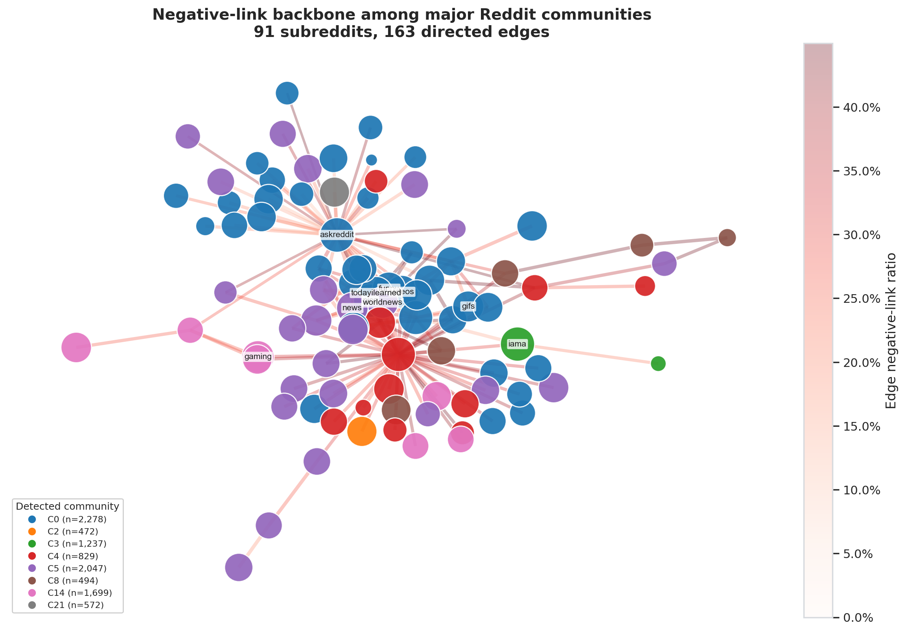

Caption: The readable negative-link backbone among major subreddit communities makes the network-analysis component visible before classification.

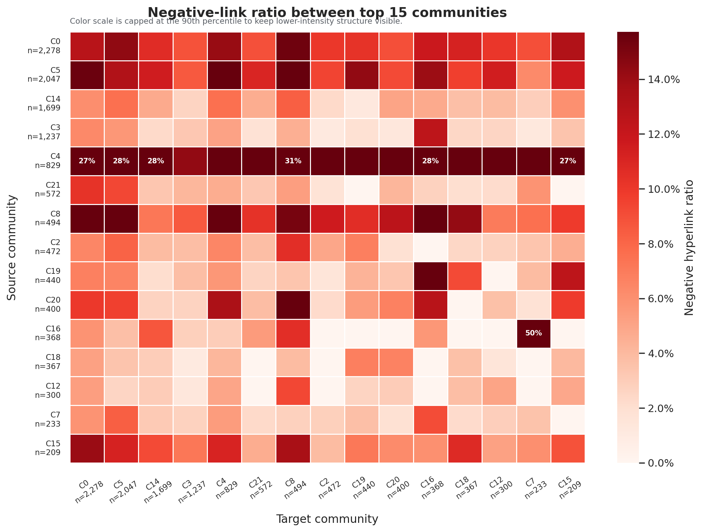

Caption: Negative-link ratios vary by source-target community pair, which motivates community-level features. The capped color scale makes high-negativity pairs visible without letting extreme cells dominate the plot.

## 6. Experimental Setup

The strict temporal split is:

| Split | History Window | Label Window | Rows |
| --- | --- | --- | ---: |
| Train | <= 2015-12-31 | 2016-01-01 to 2016-06-30 | 25,045 |
| Validation | <= 2016-06-30 | 2016-07-01 to 2016-12-31 | 26,450 |
| Test | <= 2016-12-31 | 2017-01-01 to 2017-04-30 | 24,185 |

The latest full run compares 41 model/feature-set rows across:

- Dummy most frequent.
- Dummy prior.
- Historical negative-ratio heuristic.
- Logistic Regression.
- Random Forest.
- XGBoost.
- LightGBM.

The feature-set ablations are:

- `history_only`
- `text_only`
- `graph_only`
- `graph_no_balance`
- `hybrid`
- `hybrid_no_balance`

Because negative-dominant relationships are rare, accuracy is not the headline metric. The main metric is PR-AUC, with ROC-AUC, F1, Macro-F1, precision, recall, balanced accuracy, and confusion counts as supporting metrics.

## 7. Results

Best model by test PR-AUC:

| Feature Set | Model | Test PR-AUC | Test ROC-AUC | F1 | Macro-F1 | Precision | Recall |
| --- | --- | ---: | ---: | ---: | ---: | ---: | ---: |
| `hybrid` | Logistic Regression | 0.1840 | 0.7569 | 0.2700 | 0.5935 | 0.2050 | 0.3954 |

Selected comparison:

| Feature Set | Model | Test PR-AUC | Test ROC-AUC | F1 |
| --- | --- | ---: | ---: | ---: |
| `hybrid` | Logistic Regression | 0.1840 | 0.7569 | 0.2700 |
| `hybrid_no_balance` | Logistic Regression | 0.1837 | 0.7561 | 0.2697 |
| `graph_only` | Logistic Regression | 0.1812 | 0.7508 | 0.2625 |
| `hybrid` | LightGBM | 0.1792 | 0.7626 | 0.2560 |
| `hybrid` | XGBoost | 0.1755 | 0.7532 | 0.2348 |
| `graph_no_balance` | Random Forest | 0.1730 | 0.7481 | 0.2441 |
| `history_only` | Logistic Regression | 0.1424 | 0.6905 | 0.2341 |
| `text_only` | Logistic Regression | 0.1398 | 0.7118 | 0.2202 |
| `graph_only` | Historical negative ratio | 0.1237 | 0.6328 | 0.2327 |
| `hybrid` | Dummy prior | 0.0698 | 0.5000 | 0.1304 |

The test prevalence of negative-dominant pairs is approximately 0.07. Therefore, PR-AUC 0.1840 is not large in absolute terms, but it is about 2.6 times the dummy-prior prevalence baseline and clearly above the historical-ratio heuristic. This is a more meaningful comparison than raw accuracy because most future pairs are non-negative.

The best model's test confusion counts are:

| TN | FP | FN | TP |
| ---: | ---: | ---: | ---: |
| 19,911 | 2,587 | 1,020 | 667 |

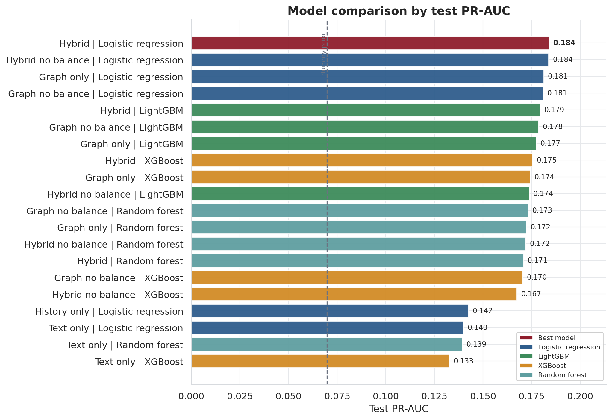

Caption: Hybrid and graph-only Logistic Regression models are the strongest by PR-AUC, while text-only and dummy baselines are weaker.

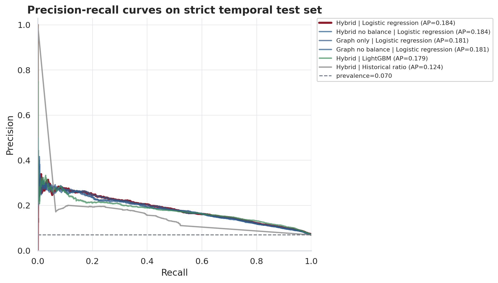

Caption: The precision-recall curve compares ranking quality under class imbalance and shows the lift above prevalence.

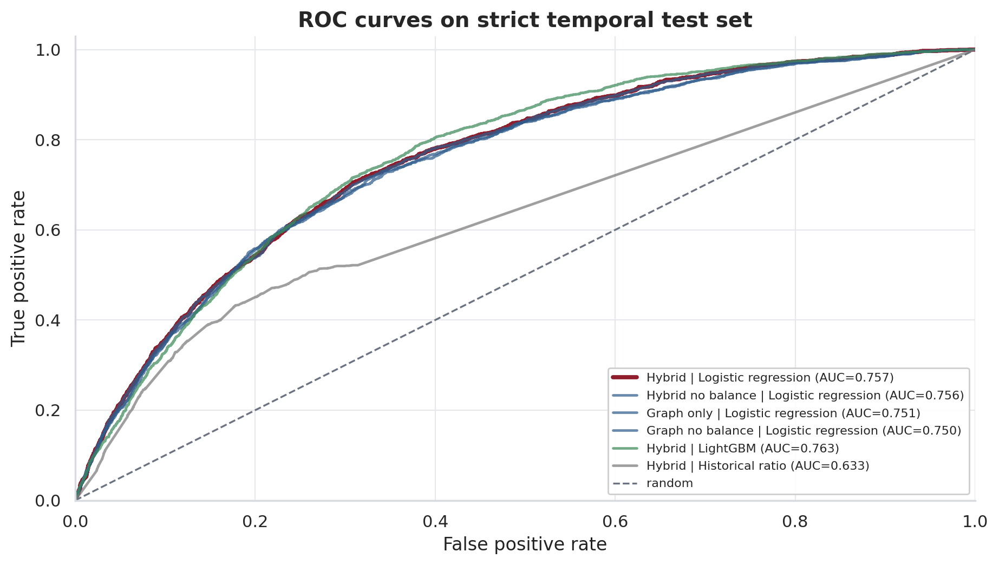

Caption: The ROC curve shows that the best model separates negative-dominant from non-negative pairs better than random ranking.

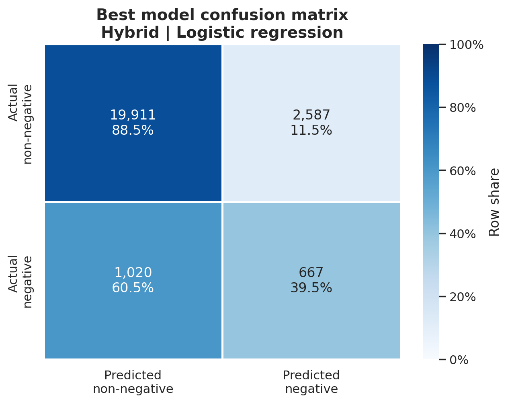

Caption: The thresholded model recalls 39.5% of negative-dominant pairs while keeping most non-negative pairs correctly classified.

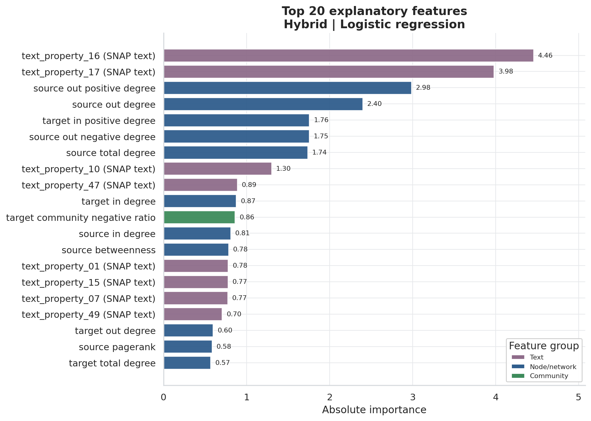

Caption: Top explanatory signals include text properties, source out-degree, source signed degree, target in-degree, source negative degree, PageRank, betweenness, and community negativity ratios.

## 8. Robustness and Error Analysis

The main model uses k-core filtering with `k=5` for tractability. To test whether conclusions are overly sensitive to graph-density filtering, the project adds a sampled robustness probe using 100,000 evenly spaced interactions from the full chronological data. The probe compares `k=3`, `k=5`, and `k=10` under two filtering modes:

- `global_k_core`: k-core is computed on the sampled interaction graph.
- `history_safe_k_core`: k-core is computed only from the training-history portion, then applied to later windows.

This probe uses a lightweight pair-history Logistic Regression model rather than the full hybrid feature set, so it should be interpreted as a robustness check for the filtering choice, not as a replacement for the main result.

| Filter Mode | k | Test PR-AUC | Test F1 | Test Recall |
| --- | ---: | ---: | ---: | ---: |
| global k-core | 3 | 0.1382 | 0.2128 | 0.3952 |
| global k-core | 5 | 0.1473 | 0.2205 | 0.4093 |
| global k-core | 10 | 0.1391 | 0.2185 | 0.3873 |
| history-safe k-core | 3 | 0.1477 | 0.2231 | 0.4258 |
| history-safe k-core | 5 | 0.1561 | 0.2269 | 0.4286 |
| history-safe k-core | 10 | 0.1594 | 0.2441 | 0.4351 |

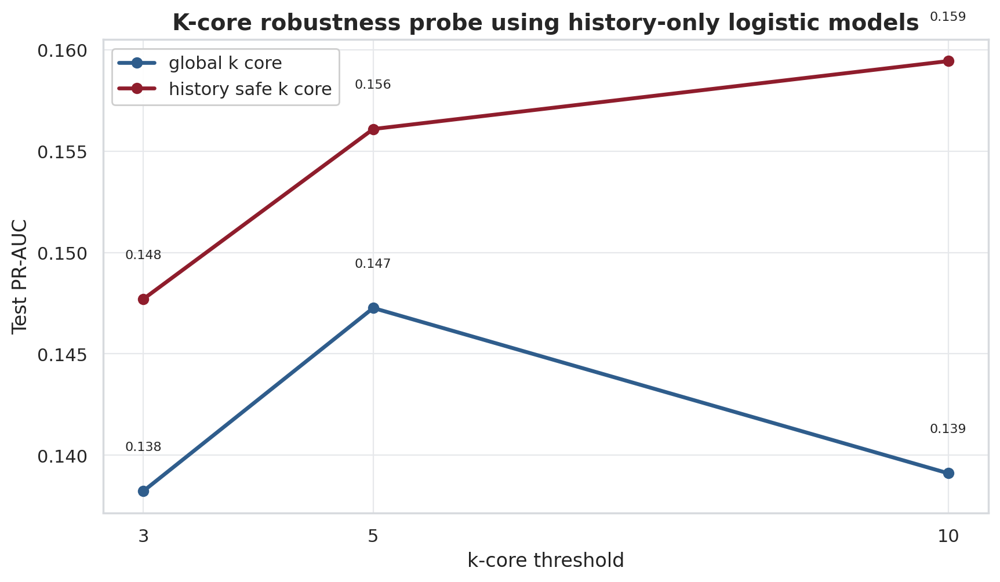

Caption: History-based signal remains above prevalence across k-core settings, and history-safe filtering does not collapse performance.

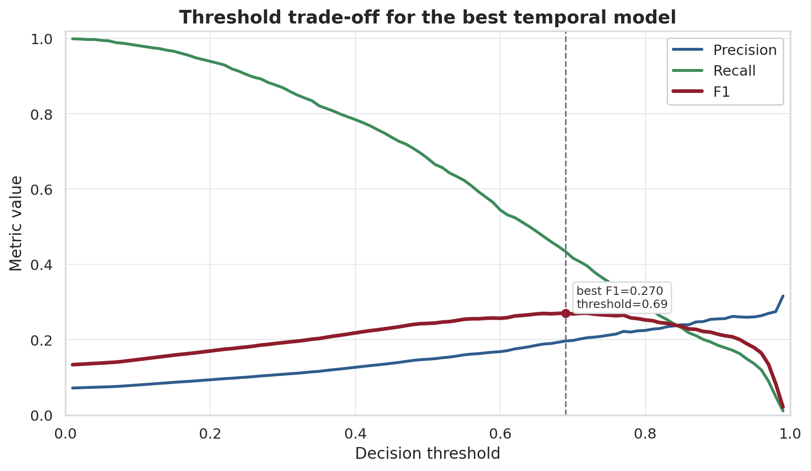

Caption: The precision-recall trade-off shows why the selected validation-tuned threshold is high: the model needs to control false positives in an imbalanced setting.

The error-analysis table `data/processed/phase3/error_analysis_cases.csv` includes representative true positives, false positives, and false negatives. False positives often occur when a pair had high historical negativity but did not become future negative-dominant in the test window. False negatives often reflect relationships with limited or weaker negative history, suggesting that richer text or user-level signals would be needed for more complete early warning.

## 9. Discussion

The results support three main findings.

First, temporal graph/history features are useful. Graph-only and graph-no-balance models are close to the hybrid model and clearly stronger than historical-ratio and dummy baselines.

Second, text-property features are helpful mainly when combined with graph/history features. Text-only models are better than dummy baselines but weaker than graph-based models, while the best model is hybrid.

Third, structural-balance features are interpretable but have limited incremental predictive lift in this strict temporal setting. The hybrid model slightly outperforms `hybrid_no_balance`, but the difference is small. Their main value is explanatory: they connect the model to signed-network theory and local relationship patterns.

The strongest practical implication is that negative cross-community relationships are not random: historical signed interactions, node positions, and community-level negativity all contribute to future risk. This makes the project relevant for moderation research and community-health monitoring, while still respecting that a hyperlink sentiment label is only a proxy.

## 10. Threats to Validity

The label is derived from `LINK_SENTIMENT` and should be treated as a proxy, not direct evidence of real-world conflict. Negative hyperlinks do not prove harassment, raids, or coordinated attacks. The dataset is historical and covers 2013-2017, so platform norms and moderation systems may differ today.

K-core filtering improves tractability and reduces sparsity, but it restricts the analysis to a denser subgraph. The robustness probe reduces this concern but is sampled and history-only, so it does not fully replace a full-scale hybrid sensitivity run. The current task predicts future relationships among historically observed source-target pairs rather than brand-new source-target pairs with no history.

The 86 text-property features are precomputed and not raw text. This improves reproducibility and privacy but limits interpretability of content-side features.

## 11. Rubric Mapping

| Rubric Criterion | Evidence in Project |
| --- | --- |
| Practicality | Real Reddit social-media data from Kaggle/SNAP, moderation/community-health application, future warning use case |
| Methodology | NetworkX graph construction, PageRank, betweenness, clustering, community detection, structural balance, ML baselines and ablations |
| Result Analysis | PR-AUC, ROC-AUC, F1, precision, recall, confusion matrix, threshold trade-off, robustness probe, error cases |
| Visualization | Label distribution, temporal trend, degree distribution, network sample, community heatmap, model comparison, PR/ROC, threshold and robustness plots |
| Report and Presentation | Full paper report, reference list, presentation outline, Q&A sheet, final PowerPoint deck |
| Creativity | Temporal signed-network framing, hybrid graph/text ablation, structural-balance interpretation, anti-leakage design, case-level analysis |

## 12. Conclusion and Future Work

This project demonstrates a practical, leakage-aware, paper-style pipeline for predicting negative-dominant cross-community relationships on Reddit. The strongest result comes from a hybrid temporal signed-network model, and the ablation study shows that graph/history features are the most stable signal family.

Future work should extend the project toward fully explainable temporal signed link prediction: signed graph embeddings, temporal GNNs, SHAP or GNNExplainer-style explanations, robustness to label noise, and evaluation on newer social-media datasets.

## References

See `docs/references.md` for the full reference list.
